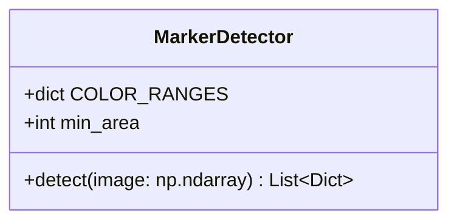
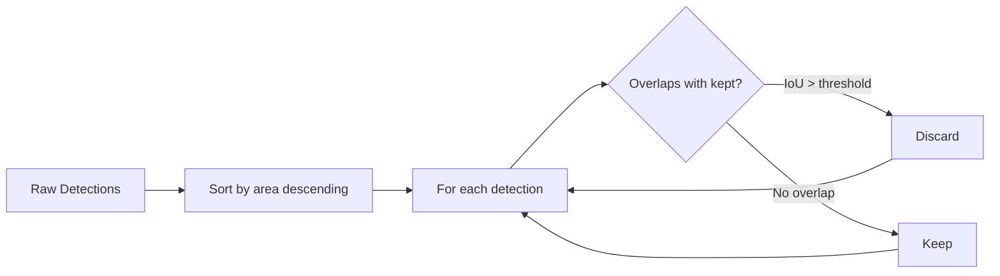

# Computer Vision

Our robot competes in the [RoboCup Rescue Robot League](https://rrl.robocup.org/), where it must navigate disaster environments and detect colored markers that represent hazardous materials, victims, and navigation signs. Our [`computer_vision`](https://github.com/Team-Isaac-Polito/reseq_ros2/tree/main/computer_vision) package uses a pipeline of detection modules — each specialized for a different marker type — feeding results into a centralized detection manager.

In this task, you will implement a simplified version of one such detection module: a **color-based marker detector** using Python and OpenCV.

## Prerequisites

You will need Python 3 and OpenCV installed. If you don't have them:

```bash
pip install opencv-python numpy
```

If you are new to OpenCV, the following resources will help:
1. [OpenCV-Python Tutorials](https://docs.opencv.org/4.x/d6/d00/tutorial_py_root.html)
2. [Color Spaces (BGR, HSV)](https://docs.opencv.org/4.x/df/d9d/tutorial_py_colorspaces.html): understanding HSV is essential for this task
3. [Contour Detection](https://docs.opencv.org/4.x/d4/d73/tutorial_py_contours_begin.html): finding shapes in images
4. [Contour Features](https://docs.opencv.org/4.x/dd/d49/tutorial_py_contour_features.html): bounding boxes, area, and shape approximation

## Generating Test Images

Since we cannot distribute real competition images, we provide a script that generates synthetic test images with colored markers:

```bash
python3 generate_test_images.py
```

This will create a `test_images/` folder with several images containing colored shapes on noisy backgrounds. Each image has an associated ground truth file (JSON) describing what markers are present.

## Task Description

In the `ComputerVision` folder you will find a file called `marker_detector.py` containing a skeleton `MarkerDetector` class and two utility functions. Your job is to complete the implementation.

### First task: implementing the MarkerDetector class

Complete the `MarkerDetector.detect()` method so that it takes a BGR image as input and returns a list of detections. Each detection is a dictionary with the following fields:

| Field    | Type            | Description                                |
|----------|-----------------|--------------------------------------------|
| `color`  | `str`           | One of `"red"`, `"green"`, `"blue"`, `"yellow"` |
| `bbox`   | `(x, y, w, h)`  | Bounding rectangle of the detected shape   |
| `center` | `(cx, cy)`      | Center coordinates of the detection        |
| `area`   | `float`         | Area of the detected contour               |

You should also fill in `COLOR_RANGES` with appropriate HSV ranges for each color. Remember that red wraps around the HSV hue spectrum, so you may need two separate ranges for it.



**Hints:**
- Convert the image from BGR to HSV color space
- Use `cv2.inRange()` to create a mask for each color
- Use `cv2.findContours()` to find shapes in each mask
- Use `cv2.boundingRect()` and `cv2.contourArea()` to extract bounding boxes and areas
- Filter out small detections using a minimum area threshold

### Second task: implementing detection filtering

When scanning an image, you may get duplicate or overlapping detections for the same marker. To clean up the output, you need to implement two functions:

1. **`compute_iou(box_a, box_b)`**: Computes the [Intersection over Union](https://en.wikipedia.org/wiki/Jaccard_index) (IoU) between two bounding boxes. Each box is represented as `(x, y, w, h)`. Returns a float between 0 and 1.

2. **`filter_detections(detections, iou_threshold)`**: Implements a simple Non-Maximum Suppression (NMS) algorithm. When two detections overlap (IoU > threshold), keep the one with the larger area and discard the other. Returns the filtered list.



### Bonus: shape classification

If you want an additional challenge, extend your detector to also classify the **shape** of each marker (circle, triangle, or rectangle). Add a `"shape"` field to the detection dictionary.

**Hint:** Use `cv2.approxPolyDP()` on the contour — the number of vertices in the approximation tells you the shape type (3 = triangle, 4 = rectangle, many = circle).

## Testing your solution

After generating the test images, you can validate your solution by running:

```bash
python3 test_detector.py
```

The test script will:
1. Load each test image and its ground truth
2. Run your `MarkerDetector` on the image
3. Check that the correct number of markers is detected
4. Verify the color classification is correct
5. Validate that bounding boxes are reasonably accurate
6. Test the `compute_iou` and `filter_detections` functions

A passing test will display: `All tests passed!`

If some tests fail, you'll see which ones and why, so you can iteratively improve your solution.

## Important note

Even if you're not very familiar with computer vision, we encourage you to attempt this task. The concepts are well-documented online, and showing that you can learn and apply new techniques is one of the main qualities we look for in new team members.

A partial solution that demonstrates understanding of the approach (e.g., correct use of HSV color spaces even if not all colors are detected) will be valued more highly than no attempt at all.
